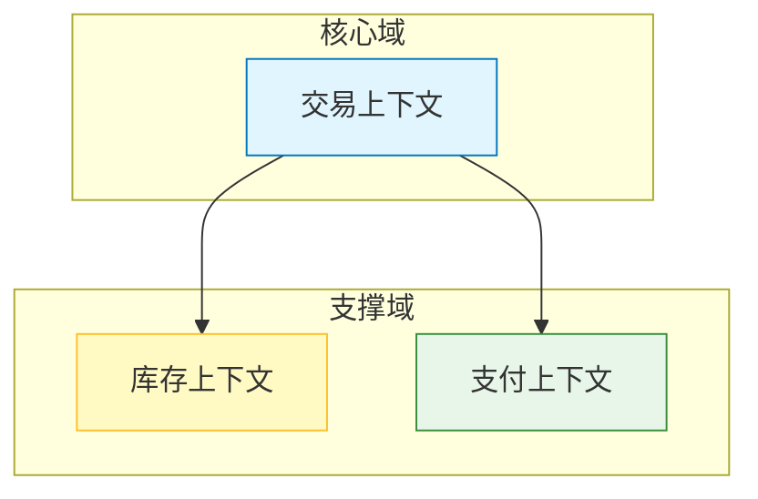
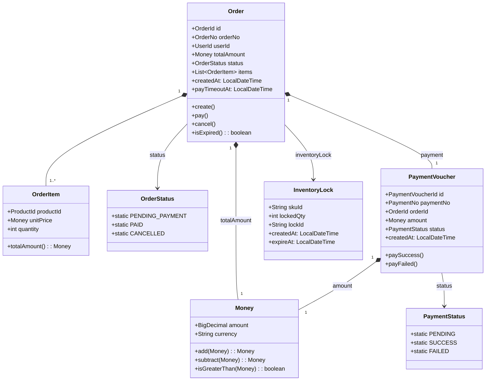

# DDD 架构设计 (DDD Architecture Design) V1.0

## 战略设计：限界上下文与子域

> **描述**：根据业务相关性，将系统划分为以下限界上下文。

| 子域类型 | 限界上下文 | 职责描述 | 关系 |
| :--- | :--- | :--- | :--- |
| **核心域** | 交易上下文 | 负责订单创建、支付、状态流转、超时取消。 | 上游 |
| **支撑域** | 库存上下文 | 负责库存预占、释放、实时库存查询。 | 下游（被交易依赖） |
| **支撑域** | 支付上下文 | 负责支付凭证生成、支付结果处理、幂等性保障。 | 下游（被交易依赖） |
| **通用域** | 用户上下文 | 负责买家标识（用户ID）验证。 | 外部系统 |

### 上下文映射图



---

## 统一语言字典

| 术语 | 定义 | 对应代码类名 |
| :--- | :--- | :--- |
| `订单` | 用户提交的购买请求，包含商品、数量、金额，具有生命周期状态。 | `Order` |
| `订单项` | 订单中包含的具体商品明细（本项目简化为直接存储在订单中）。 | `OrderItem` |
| `支付凭证` | 用户发起支付后生成的支付流水记录。 | `PaymentVoucher` |
| `库存预占` | 订单创建时， temporarily 锁定商品库存的行为。 | `InventoryLock` |
| `库存释放` | 订单取消时，将预占的库存释放回可售库存池的行为。 | `InventoryRelease` |
| `支付回调` | 支付渠道通知系统支付结果的动作。 | `PaymentCallback` |
| `超时取消` | 订单超过支付时限后，系统自动取消订单的行为。 | `OrderTimeoutCancel` |
| `超卖` | 售出商品数量超过实际库存的业务事故。 | `OverSellException` |

---

## 战术设计：领域模型

> **描述**：交易上下文的核心领域模型结构。

### 聚合设计

| 聚合根 | 聚合内实体/值对象 | 一致性边界 |
| :--- | :--- | :--- |
| **Order** | OrderItem, Money, OrderStatus, OrderNo | 订单创建、状态流转、取消必须保持一致性 |
| **PaymentVoucher** | PaymentStatus, PaymentNo, Money | 支付凭证的创建和状态更新保持一致性 |

### 领域模型类图



### 仓储接口（领域层）

```java
// 领域层定义，不依赖基础设施

public interface OrderRepository {
    Order findById(OrderId id);
    void save(Order order);
    Order findByOrderNo(OrderNo orderNo);
}

public interface PaymentVoucherRepository {
    PaymentVoucher findById(PaymentVoucherId id);
    void save(PaymentVoucher voucher);
    PaymentVoucher findByOrderId(OrderId orderId);
}

public interface InventoryLockRepository {
    InventoryLock findBySkuId(String skuId);
    void save(InventoryLock lock);
    void remove(String skuId);
}
```

---

## 应用层编排

### 应用服务接口

```java
// 应用层：负责业务流程编排，不包含核心业务逻辑

public interface OrderApplicationService {
    OrderResponse createOrder(CreateOrderCommand command);
    void payOrder(PayOrderCommand command);
    void cancelOrder(IdCommand command);
    OrderResponse queryOrder(IdCommand command);
}

public interface PaymentApplicationService {
    PaymentResponse pay(PayCommand command);
    void handlePaymentCallback(PaymentCallback callback);
}

public interface InventoryApplicationService {
    boolean lock(InventoryLockCommand command);
    void release(InventoryReleaseCommand command);
}
```

### 应用服务流程

**下单流程编排**：
1. 调用 `InventoryApplicationService.lock()` 预占库存
2. 调用 `OrderApplicationService.createOrder()` 创建订单
3. 发布 `OrderCreatedEvent` 事件
4. 返回订单信息

**支付流程编排**：
1. 订单服务接收支付请求
2. 调用 `PaymentApplicationService.pay()` 生成支付凭证
3. 发布 `PaymentVoucherCreatedEvent` 事件
4. 返回支付信息

**支付回调编排**：
1. 支付服务接收回调
2. 解析并校验回调数据
3. 发布 `PaymentSuccessEvent` 到 RocketMQ
4. 订单服务消费事件，调用库存服务释放预占

---

## 项目结构与分层架构

### 目录结构树

```
order-pay-domain/
├── interfaces/              # 用户接口层（HTTP API）
│   ├── controller/
│   │   ├── OrderController
│   │   └── PaymentController
│   └── dto/
│       ├── CreateOrderRequest
│       └── PayOrderRequest
│
├── application/             # 应用层（业务编排）
│   ├── service/
│   │   ├── OrderApplicationService
│   │   └── PaymentApplicationService
│   └── event/
│       └── listener/
│           └── PaymentCallbackListener
│
├── domain/                  # 领域层（核心业务逻辑）
│   ├── model/
│   │   ├── Order
│   │   ├── OrderItem
│   │   ├── Money
│   │   └── PaymentVoucher
│   ├── repository/
│   │   ├── OrderRepository
│   │   └── PaymentVoucherRepository
│   ├── service/
│   │   └── OrderDomainService
│   └── event/
│       └── OrderCreatedEvent
│
├── infrastructure/          # 基础设施层（数据库、Redis、MQ）
│   ├── repository/
│   │   ├── OrderRepositoryImpl
│   │   └── PaymentVoucherRepositoryImpl
│   ├── convert/
│   │   └──.converter/
│   └── message/
│       └── RocketMQProducer
│
└── common/                  # 公共模块
    ├── exception/
    ├── util/
    └── constant/
```

### 各层职责

| 层级 | 职责 | 依赖方向 |
| :--- | :--- | :--- |
| **Interfaces** | 处理 HTTP 请求/响应，参数校验，异常转换 | → Application |
| **Application** | 业务流程编排，事务管理，事件发布 | → Domain, Infrastructure |
| **Domain** | 核心业务逻辑，领域模型，聚合根 | 独立，不依赖其他层 |
| **Infrastructure** | 数据库访问，Redis 操作，MQ 消息发送 | → Domain（依赖仓储接口） |

---

## 修改日志

1. **[初稿]** 2026-04-16：基于 PRD 生成 DDD 架构设计文档
2. **[修正]** 2026-04-16：完善聚合设计，明确 Order 为聚合根
3. **[修正]** 2026-04-16：添加应用层编排说明和目录结构
