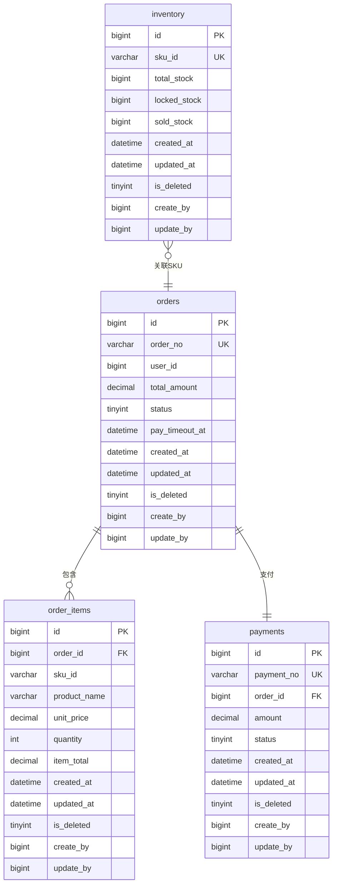

# 数据库设计 (Database Design) V1.0

## 核心设计原则

| 原则 | 说明 |
| :--- | :--- |
| **命名规范** | 表名、字段名使用小写蛇形命名法（snake_case） |
| **审计字段强制** | 每张表必须包含：created_at, updated_at, is_deleted, create_by, update_by |
| **金额字段** | 统一使用 DECIMAL(18,2) |
| **状态字段** | 统一使用 TINYINT |
| **逻辑删除** | 使用 is_deleted 字段（0:未删除, 1:已删除） |

---

## 实体关系图 (ER Diagram)



---

## 数据表详细设计

### orders
> **描述**：存储电商系统的订单主表信息。

#### 字段定义
| 字段名 | 类型 | 允许空 | 默认值 | 说明 | 示例 |
| :--- | :--- | :--- | :--- | :--- | :--- |
| `id` | BIGINT | 否 | - | **主键 ID** | 10001 |
| `order_no` | VARCHAR(32) | 否 | - | **订单编号 (唯一)** | "ORD20260415001" |
| `user_id` | BIGINT | 否 | - | **下单用户 ID** | 888 |
| `total_amount` | DECIMAL(18,2) | 否 | 0.00 | **订单总金额** | 99.50 |
| `status` | TINYINT | 否 | 0 | **状态**: 0-待付款, 1-已支付, 2-已取消 | 0 |
| `pay_timeout_at` | DATETIME | 否 | - | **支付截止时间** (下单时间 + 15分钟) | 2026-04-15 10:15:00 |
| `created_at` | DATETIME | 否 | NOW() | 创建时间 | 2026-04-15 10:00:00 |
| `updated_at` | DATETIME | 否 | NOW() | 更新时间 | 2026-04-15 10:05:00 |
| `is_deleted` | TINYINT | 否 | 0 | **逻辑删除**: 0-否, 1-是 | 0 |
| `create_by` | BIGINT | 是 | NULL | **创建人 ID** | 888 |
| `update_by` | BIGINT | 是 | NULL | **更新人 ID** | 888 |

#### 索引设计
- **主键索引**: `PRIMARY KEY (id)`
- **唯一索引**: `UK_ORDER_NO (order_no)` - 保证订单号不重复
- **普通索引**: `IDX_USER_STATUS (user_id, status)` - 用于加速"查询某用户的待支付订单"
- **普通索引**: `IDX_PAY_TIMEOUT (pay_timeout_at)` - 用于订单超时取消定时任务扫描

#### SQL 建表语句
```sql
CREATE TABLE `orders` (
  `id` BIGINT NOT NULL AUTO_INCREMENT COMMENT '主键ID',
  `order_no` VARCHAR(32) NOT NULL COMMENT '订单编号',
  `user_id` BIGINT NOT NULL COMMENT '下单用户ID',
  `total_amount` DECIMAL(18,2) NOT NULL DEFAULT '0.00' COMMENT '订单总金额',
  `status` TINYINT NOT NULL DEFAULT 0 COMMENT '状态: 0-待付款, 1-已支付, 2-已取消',
  `pay_timeout_at` DATETIME NOT NULL COMMENT '支付截止时间',
  `created_at` DATETIME NOT NULL DEFAULT CURRENT_TIMESTAMP COMMENT '创建时间',
  `updated_at` DATETIME NOT NULL DEFAULT CURRENT_TIMESTAMP ON UPDATE CURRENT_TIMESTAMP COMMENT '更新时间',
  `is_deleted` TINYINT NOT NULL DEFAULT 0 COMMENT '逻辑删除: 0-否, 1-是',
  `create_by` BIGINT DEFAULT NULL COMMENT '创建人ID',
  `update_by` BIGINT DEFAULT NULL COMMENT '更新人ID',
  PRIMARY KEY (`id`),
  UNIQUE KEY `UK_ORDER_NO` (`order_no`),
  KEY `IDX_USER_STATUS` (`user_id`, `status`),
  KEY `IDX_PAY_TIMEOUT` (`pay_timeout_at`)
) ENGINE=InnoDB DEFAULT CHARSET=utf8mb4 COMMENT='订单主表';
```

### order_items
> **描述**：订单明细表，存储订单中每个商品项的详细信息。

#### 字段定义
| 字段名 | 类型 | 允许空 | 默认值 | 说明 | 示例 |
| :--- | :--- | :--- | :--- | :--- | :--- |
| `id` | BIGINT | 否 | - | **主键 ID** | 10001 |
| `order_id` | BIGINT | 否 | - | **订单ID (外键)** | 1001 |
| `sku_id` | VARCHAR(64) | 否 | - | **SKU 编号** | "SKU001" |
| `product_name` | VARCHAR(128) | 否 | - | **商品名称** | "iPhone 15" |
| `unit_price` | DECIMAL(18,2) | 否 | 0.00 | **单价** | 5999.00 |
| `quantity` | INT | 否 | 1 | **购买数量** | 1 |
| `item_total` | DECIMAL(18,2) | 否 | 0.00 | **商品小计** | 5999.00 |
| `created_at` | DATETIME | 否 | NOW() | 创建时间 | 2026-04-15 10:00:00 |
| `updated_at` | DATETIME | 否 | NOW() | 更新时间 | 2026-04-15 10:05:00 |
| `is_deleted` | TINYINT | 否 | 0 | **逻辑删除**: 0-否, 1-是 | 0 |
| `create_by` | BIGINT | 是 | NULL | **创建人 ID** | 888 |
| `update_by` | BIGINT | 是 | NULL | **更新人 ID** | 888 |

#### 索引设计
- **主键索引**: `PRIMARY KEY (id)`
- **普通索引**: `IDX_ORDER_ID (order_id)` - 用于查询订单明细
- **普通索引**: `IDX_SKU_ID (sku_id)` - 用于查询 SKU 的订单占比

#### SQL 建表语句
```sql
CREATE TABLE `order_items` (
  `id` BIGINT NOT NULL AUTO_INCREMENT COMMENT '主键ID',
  `order_id` BIGINT NOT NULL COMMENT '订单ID',
  `sku_id` VARCHAR(64) NOT NULL COMMENT 'SKU编号',
  `product_name` VARCHAR(128) NOT NULL COMMENT '商品名称',
  `unit_price` DECIMAL(18,2) NOT NULL DEFAULT '0.00' COMMENT '单价',
  `quantity` INT NOT NULL DEFAULT 1 COMMENT '购买数量',
  `item_total` DECIMAL(18,2) NOT NULL DEFAULT '0.00' COMMENT '商品小计',
  `created_at` DATETIME NOT NULL DEFAULT CURRENT_TIMESTAMP COMMENT '创建时间',
  `updated_at` DATETIME NOT NULL DEFAULT CURRENT_TIMESTAMP ON UPDATE CURRENT_TIMESTAMP COMMENT '更新时间',
  `is_deleted` TINYINT NOT NULL DEFAULT 0 COMMENT '逻辑删除: 0-否, 1-是',
  `create_by` BIGINT DEFAULT NULL COMMENT '创建人ID',
  `update_by` BIGINT DEFAULT NULL COMMENT '更新人ID',
  PRIMARY KEY (`id`),
  KEY `IDX_ORDER_ID` (`order_id`),
  KEY `IDX_SKU_ID` (`sku_id`)
) ENGINE=InnoDB DEFAULT CHARSET=utf8mb4 COMMENT='订单明细表';
```

### inventory
> **描述**：库存表，记录每个 SKU 的库存总量、预占库存和已售库存。

#### 字段定义
| 字段名 | 类型 | 允许空 | 默认值 | 说明 | 示例 |
| :--- | :--- | :--- | :--- | :--- | :--- |
| `id` | BIGINT | 否 | - | **主键 ID** | 10001 |
| `sku_id` | VARCHAR(64) | 否 | - | **SKU 编号 (唯一)** | "SKU001" |
| `total_stock` | BIGINT | 否 | 0 | **总库存量** | 1000 |
| `locked_stock` | BIGINT | 否 | 0 | **预占库存量** (已被锁定但未支付) | 50 |
| `sold_stock` | BIGINT | 否 | 0 | **已售库存量** (已支付确认) | 100 |
| `created_at` | DATETIME | 否 | NOW() | 创建时间 | 2026-04-15 10:00:00 |
| `updated_at` | DATETIME | 否 | NOW() | 更新时间 | 2026-04-15 10:05:00 |
| `is_deleted` | TINYINT | 否 | 0 | **逻辑删除**: 0-否, 1-是 | 0 |
| `create_by` | BIGINT | 是 | NULL | **创建人 ID** | 888 |
| `update_by` | BIGINT | 是 | NULL | **更新人 ID** | 888 |

#### 索引设计
- **主键索引**: `PRIMARY KEY (id)`
- **唯一索引**: `UK_SKU_ID (sku_id)` - 保证 SKU 唯一性
- **普通索引**: `IDX_SKU_ID (sku_id)` - 用于库存预占和释放查询

#### SQL 建表语句
```sql
CREATE TABLE `inventory` (
  `id` BIGINT NOT NULL AUTO_INCREMENT COMMENT '主键ID',
  `sku_id` VARCHAR(64) NOT NULL COMMENT 'SKU编号',
  `total_stock` BIGINT NOT NULL DEFAULT 0 COMMENT '总库存量',
  `locked_stock` BIGINT NOT NULL DEFAULT 0 COMMENT '预占库存量',
  `sold_stock` BIGINT NOT NULL DEFAULT 0 COMMENT '已售库存量',
  `created_at` DATETIME NOT NULL DEFAULT CURRENT_TIMESTAMP COMMENT '创建时间',
  `updated_at` DATETIME NOT NULL DEFAULT CURRENT_TIMESTAMP ON UPDATE CURRENT_TIMESTAMP COMMENT '更新时间',
  `is_deleted` TINYINT NOT NULL DEFAULT 0 COMMENT '逻辑删除: 0-否, 1-是',
  `create_by` BIGINT DEFAULT NULL COMMENT '创建人ID',
  `update_by` BIGINT DEFAULT NULL COMMENT '更新人ID',
  PRIMARY KEY (`id`),
  UNIQUE KEY `UK_SKU_ID` (`sku_id`),
  KEY `IDX_SKU_ID` (`sku_id`)
) ENGINE=InnoDB DEFAULT CHARSET=utf8mb4 COMMENT='库存表';
```

### payments
> **描述**：支付流水表，记录每笔支付的凭证信息。

#### 字段定义
| 字段名 | 类型 | 允许空 | 默认值 | 说明 | 示例 |
| :--- | :--- | :--- | :--- | :--- | :--- |
| `id` | BIGINT | 否 | - | **主键 ID** | 10001 |
| `payment_no` | VARCHAR(32) | 否 | - | **支付流水号 (唯一)** | "PAY20260415001" |
| `order_id` | BIGINT | 否 | - | **订单ID (外键)** | 1001 |
| `amount` | DECIMAL(18,2) | 否 | 0.00 | **支付金额** | 99.50 |
| `status` | TINYINT | 否 | 0 | **状态**: 0-处理中, 1-支付成功, 2-支付失败 | 0 |
| `created_at` | DATETIME | 否 | NOW() | 创建时间 | 2026-04-15 10:00:00 |
| `updated_at` | DATETIME | 否 | NOW() | 更新时间 | 2026-04-15 10:05:00 |
| `is_deleted` | TINYINT | 否 | 0 | **逻辑删除**: 0-否, 1-是 | 0 |
| `create_by` | BIGINT | 是 | NULL | **创建人 ID** | 888 |
| `update_by` | BIGINT | 是 | NULL | **更新人 ID** | 888 |

#### 索引设计
- **主键索引**: `PRIMARY KEY (id)`
- **唯一索引**: `UK_PAYMENT_NO (payment_no)` - 保证支付流水号不重复
- **普通索引**: `IDX_ORDER_ID (order_id)` - 用于查询订单的支付记录
- **普通索引**: `IDX_STATUS (status)` - 用于支付结果轮询

#### SQL 建表语句
```sql
CREATE TABLE `payments` (
  `id` BIGINT NOT NULL AUTO_INCREMENT COMMENT '主键ID',
  `payment_no` VARCHAR(32) NOT NULL COMMENT '支付流水号',
  `order_id` BIGINT NOT NULL COMMENT '订单ID',
  `amount` DECIMAL(18,2) NOT NULL DEFAULT '0.00' COMMENT '支付金额',
  `status` TINYINT NOT NULL DEFAULT 0 COMMENT '状态: 0-处理中, 1-支付成功, 2-支付失败',
  `created_at` DATETIME NOT NULL DEFAULT CURRENT_TIMESTAMP COMMENT '创建时间',
  `updated_at` DATETIME NOT NULL DEFAULT CURRENT_TIMESTAMP ON UPDATE CURRENT_TIMESTAMP COMMENT '更新时间',
  `is_deleted` TINYINT NOT NULL DEFAULT 0 COMMENT '逻辑删除: 0-否, 1-是',
  `create_by` BIGINT DEFAULT NULL COMMENT '创建人ID',
  `update_by` BIGINT DEFAULT NULL COMMENT '更新人ID',
  PRIMARY KEY (`id`),
  UNIQUE KEY `UK_PAYMENT_NO` (`payment_no`),
  KEY `IDX_ORDER_ID` (`order_id`),
  KEY `IDX_STATUS` (`status`)
) ENGINE=InnoDB DEFAULT CHARSET=utf8mb4 COMMENT='支付流水表';
```

---

## 修改日志

1. **[初稿]** 2026-04-16：基于 PRD 生成数据库设计文档，包含 4 张核心表（orders, order_items, inventory, payments）
2. **[修正]** 2026-04-16：统一所有金额字段为 DECIMAL(18,2)，状态字段为 TINYINT
3. **[修正]** 2026-04-16：为所有表添加审计字段（created_at, updated_at, is_deleted, create_by, update_by）
4. **[修正]** 2026-04-16：补充支付流水表设计，支持支付状态管理
5. **[修正]** 2026-04-16：为订单表添加 pay_timeout_at 字段，用于超时取消定时任务扫描
