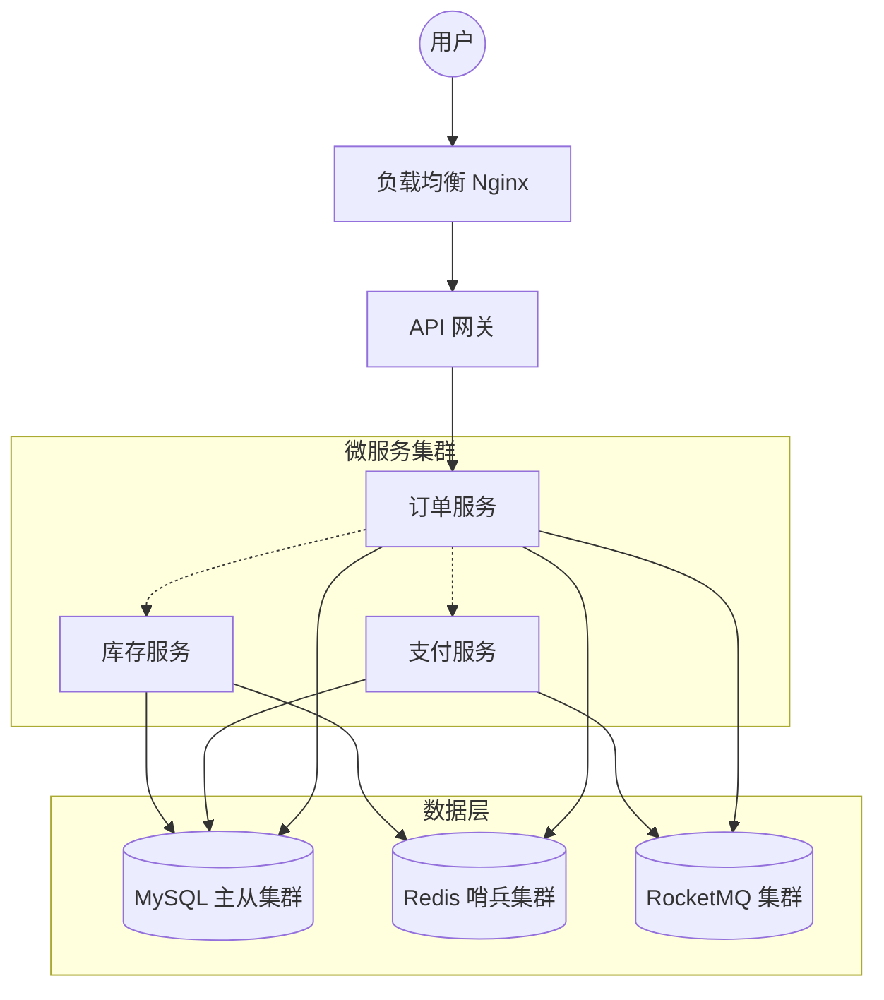
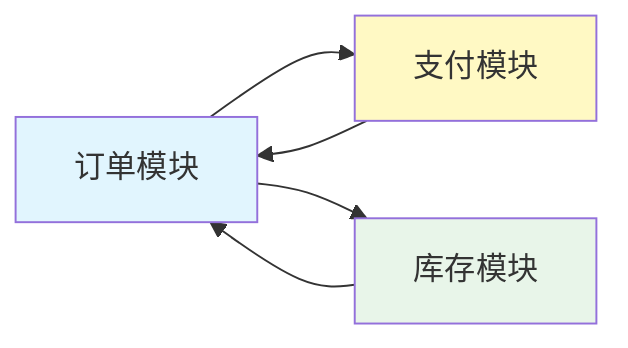

# 系统架构与模块设计 (System Architecture & Module Design) V1.0

## 技术栈选型

> **设计原则**：选择成熟、社区活跃且适合本项目规模的技术。

| 分类 | 技术选型 | 版本 | 选型理由 |
| :--- | :--- | :--- | :--- |
| **后端框架** | Spring Boot | 3.x | 生态成熟，适合构建企业级微服务，提供完善的事务管理和AOP支持 |
| **数据库** | MySQL | 8.0 | 强一致性，支持事务，适合核心交易数据存储 |
| **缓存** | Redis | 7.0 | 高性能读写，用于库存预占锁、订单超时检测缓存 |
| **消息队列** | RocketMQ | 5.0 | 支持事务消息，用于支付回调异步处理和订单状态通知 |
| **任务调度** | XXL-JOB / JobScheduler | 2.x | 用于定时任务，如订单超时检测与取消 |

---

## 系统总体架构

> **描述**：系统采用经典的微服务分层架构，通过 API 网关统一入口，内部服务通过 HTTP 通信。



**架构模式**：单体架构（初期），支持未来拆分为微服务

**流量走向**：
1. 用户发起下单/支付请求 → Nginx 负载均衡 → API 网关
2. 网关路由请求到对应服务（订单服务、支付服务）
3. 服务层调用数据库、Redis 缓存、消息队列完成业务逻辑
4. 支付回调通过RocketMQ异步通知订单服务

---

## 模块设计与依赖

> **基于 DDD 的限界上下文划分**

### 模块划分

| 模块名称 | 职责描述 | 对外提供能力 |
| :--- | :--- | :--- |
| **订单模块** | 订单生命周期管理、状态流转、超时检测 | 创建订单、查询订单、取消订单 |
| **支付模块** | 支付凭证生成、支付结果处理、幂等性保障 | 发起支付、处理回调、查询支付状态 |
| **库存模块** | 库存预占、释放、实时库存查询 | 预占库存、释放库存、查询可用库存 |

### 模块依赖关系图



**依赖说明**：
- 订单模块依赖支付模块（需要处理支付结果）
- 订单模块依赖库存模块（需要进行库存预占和释放）
- 支付模块被订单模块依赖（接收订单创建后的支付请求）

---

## 关键基础设施设计

### 缓存策略

**Redis 使用场景**：

| 场景 | 缓存类型 | 过期时间 | 说明 |
| :--- | :--- | :--- | :--- |
| 库存预占锁 | 分布式锁 | 30s | 使用 Redisson RedLock 防止超卖 |
| 订单超时检测 | SortedSet | 动态 | Key: 订单创建时间, Score: 超时时间戳 |
| 支付幂等 Key | String | 24h | 防止重复支付回调处理 |

**缓存更新策略**：Cache-Aside（旁路缓存）

### 异步通信

**RocketMQ Topic 设计**：

| Topic | 生产者 | 消费者 | 消息内容 |
| :--- | :--- | :--- | :--- |
| `orderpay-order-created` | 订单服务 | 支付服务 | 订单创建成功通知 |
| `orderpay-order-timeout` | 定时任务 | 订单服务 | 订单超时取消通知 |
| `orderpay-pay-result` | 支付服务 | 订单服务 | 支付结果回调 |

### 数据一致性方案

**库存预占一致性**：
- 使用 Redis 分布式锁确保并发场景下的库存扣减原子性
- 锁粒度：商品级别（`lock:stock:{sku_id}`）

**订单状态一致性**：
- 订单创建：数据库事务 + Redis 订单状态缓存
- 支付回调：MQ 保证消息不丢失 + 幂等性处理

---

## 部署与运维

### 部署拓扑

```
用户端
   |
[Nginx] (负载均衡)
   |
[API Gateway] (单实例 / 多实例)
   |
[Order Service] (多实例)
[Pay Service] (多实例)
[Stock Service] (多实例)
   |
[MySQL 主从集群] (一主两从)
[Redis 哨兵集群] (一主两从)
[RocketMQ 集群] (双主双从)
```

### 配置管理

| 配置项 | 配置中心 | 说明 |
| :--- | :--- | :--- |
| 数据库连接参数 | Apollo / Nacos | 数据库地址、账号、密码 |
| Redis 连接参数 | Apollo / Nacos | Redis 地址、端口、密码 |
| RocketMQ 名称服务器 | Apollo / Nacos | Nameserver 地址 |
| 订单超时配置 | Apollo / Nacos | **15分钟**（可动态调整） |
| 支付模拟开关 | Apollo / Nacos | 开发/测试环境模拟支付 |

### 监控指标

- **业务指标**：订单创建成功率、支付成功率、库存预占成功率
- **系统指标**：API 响应时间、QPS、错误率
- **数据库指标**：慢查询、连接池使用率、主从延迟

---

## 修改日志

1. **[初稿]** 2026-04-16：基于 PRD 生成系统架构与模块设计文档
2. **[修正]** 2026-04-16：补充 Redis 缓存策略和 RocketMQ Topic 设计
3. **[修正]** 2026-04-16：明确订单超时配置为可动态调整参数
