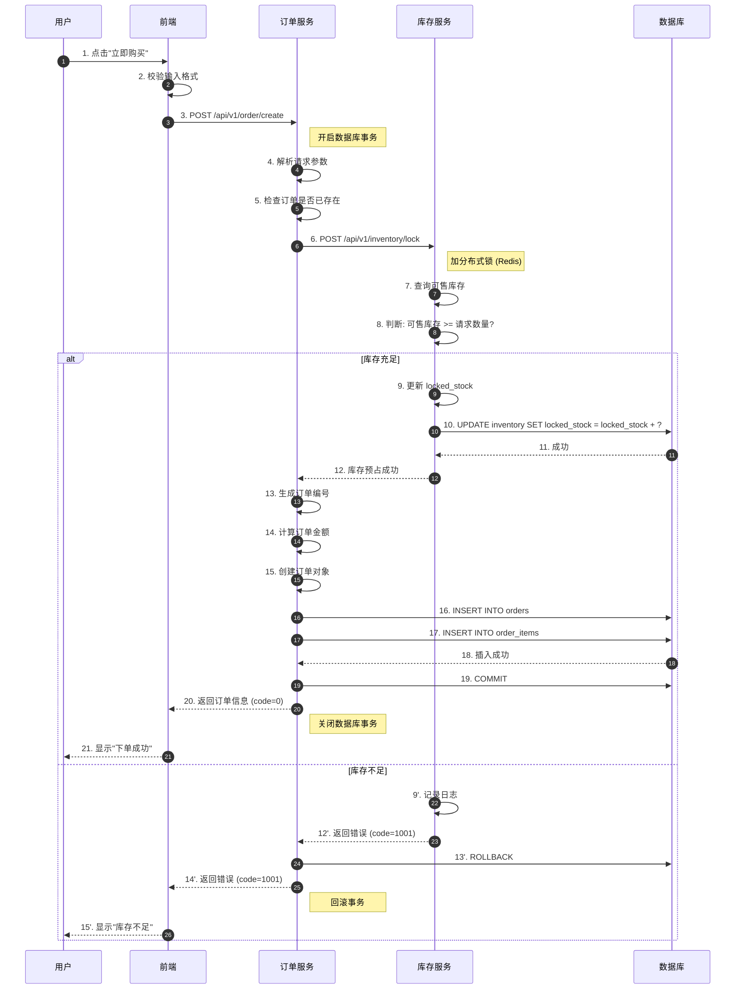
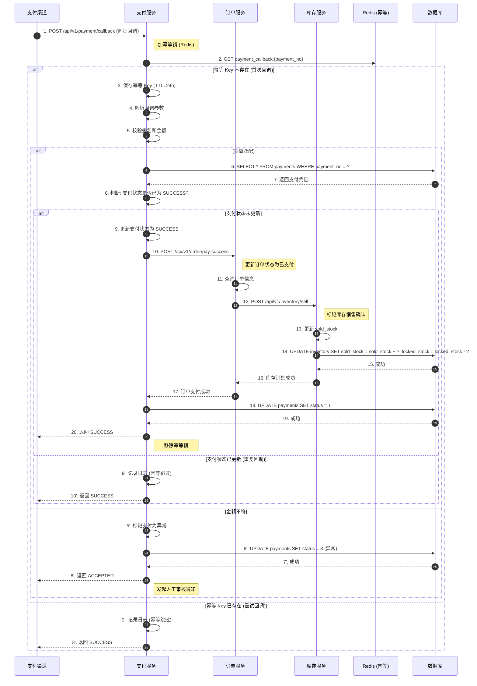

# 详细业务流程设计 (Detailed Business Process Design) V1.0

---

## 一、用户下单业务流程

> **描述**：用户从点击"立即购买"到订单创建成功的完整业务流转，涉及用户、前端、订单服务、库存服务和数据库的交互。

### 业务泳道流程图

```mermaid
flowchart TD
    %% 定义样式
    classDef startend fill:#f9f,stroke:#333,stroke-width:2px;
    classDef process fill:#e1f5fe,stroke:#0277bd,stroke-width:2px;
    classDef decision fill:#fff9c4,stroke:#fbc02d,stroke-width:2px;
    classDef error fill:#ffcdd2,stroke:#d32f2f,stroke-width:2px;

    %% 角色/泳道
    subgraph UserLane [用户端]
        Start([开始: 点击购买]) :::startend
        SelectItem[选择商品和数量] :::process
        ClickBuy[点击"立即购买"] :::process
        ShowResult[显示下单结果] :::process
    end

    subgraph Frontend [前端应用]
        ValidateInput[校验输入格式] :::process
        SendRequest[发送 POST /api/v1/order/create 请求] :::process
    end

    subgraph OrderService [订单服务]
        ParseRequest[解析请求参数] :::process
        CheckOrderStatus{订单是否已存在?} :::decision
        ValidateStock{库存充足?} :::decision
        LockInventory[库存服务预占库存] :::process
        GenerateOrder[生成订单记录] :::process
        ReturnSuccess[返回订单信息] :::process
        ReturnError[返回错误信息] :::process
    end

    subgraph InventoryService [库存服务]
        CheckAvailable{可售库存 >= 购买数量?} :::decision
        LockStock[执行库存预占] :::process
        ReleaseStock[库存回滚] :::process
    end

    subgraph Database [数据库]
        InsertOrder[(插入订单表)] :::process
        UpdateInventory[(更新库存表)] :::process
    end

    %% 流程连线（快乐路径）
    Start --> SelectItem
    SelectItem --> ClickBuy
    ClickBuy --> ValidateInput
    ValidateInput --> SendRequest
    SendRequest --> ParseRequest
    ParseRequest --> CheckOrderStatus
    
    CheckOrderStatus -- 订单已存在 --> ReturnError
    ReturnError --> ShowResult
    
    CheckOrderStatus -- 订单不存在 --> ValidateStock
    
    ValidateStock -- 库存不足 --> ReturnError
    ReturnError --> ShowResult
    
    ValidateStock -- 库存充足 --> LockInventory
    LockInventory --> CheckAvailable
    
    CheckAvailable -- 可用库存不足 --> ReleaseStock
    ReleaseStock --> ReturnError
    
    CheckAvailable -- 可用库存充足 --> LockStock
    LockStock --> UpdateInventory
    UpdateInventory --> GenerateOrder
    GenerateOrder --> InsertOrder
    InsertOrder --> ReturnSuccess
    ReturnSuccess --> ShowResult
    ShowResult --> End([结束]) :::startend
```

### 异常泳道补充说明

| 异常场景 | 触发条件 | 处理方式 |
|:---------|:---------|:---------|
| **库存冲突** | 并发请求同时预占库存 | 库存服务返回失败，订单服务回滚并提示"库存不足" |
| **数据库写入失败** | 事务提交失败 | 整个事务回滚，库存预占自动释放，提示"系统繁忙，请重试" |
| **网络超时** | 调用库存服务超时 | 订单服务抛出超时异常，提示"服务暂时不可用" |

---

## 二、支付流程（含超时取消）

> **描述**：用户发起支付、支付回调处理以及订单超时自动取消的完整业务流程。

### 业务泳道流程图

```mermaid
flowchart TD
    %% 定义样式
    classDef startend fill:#f9f,stroke:#333,stroke-width:2px;
    classDef process fill:#e1f5fe,stroke:#0277bd,stroke-width:2px;
    classDef decision fill:#fff9c4,stroke:#fbc02d,stroke-width:2px;
    classDef timeout fill:#e3f2fd,stroke:#1976d2,stroke-width:2px;

    %% 角色/泳道
    subgraph UserLane [用户端]
        Start([开始: 下单成功]) :::startend
        ClickPay[点击"立即支付"] :::process
        ShowPayResult[显示支付结果] :::process
    end

    subgraph OrderService [订单服务]
        CheckTimeout{订单是否超时?} :::decision
        GeneratePayment[生成支付凭证] :::process
        CheckPayStatus{支付状态?} :::decision
        PaySuccess[支付成功] :::process
        PayFailed[支付失败] :::process
        CancelOrder[取消订单] :::process
    end

    subgraph PaymentService [支付服务]
        CreateVoucher[创建支付流水] :::process
        HandleCallback[处理支付回调] :::process
        VerifyAmount{金额是否匹配?} :::decision
        UpdateStatus[更新支付状态] :::process
    end

    subgraph InventoryService [库存服务]
        ReleaseLock[释放预占库存] :::process
        ConfirmSale[确认库存销售] :::process
    end

    subgraph JobScheduler [定时任务]
        ScanTimeout[扫描超时订单] :::process
        CheckPayTimeout{订单创建时间 > 15分钟?} :::decision
    end

    subgraph Database [数据库]
        UpdateOrder[(更新订单状态)] :::process
        UpdateInventory[(更新库存)] :::process
    end

    subgraph MQ [消息队列]
        PublishEvent[发布订单超时事件] :::process
        ConsumeEvent[消费超时事件] :::process
    end

    %% 正常支付流程
    Start --> ClickPay
    ClickPay --> OrderService
    OrderService --> CheckTimeout
    
    CheckTimeout -- 订单已超时 --> CancelOrder
    CancelOrder --> ShowPayResult
    
    CheckTimeout -- 订单未超时 --> GeneratePayment
    GeneratePayment --> CreateVoucher
    CreateVoucher --> ShowPayResult
    ShowPayResult --> UserLane

    %% 支付回调流程
    ApplyResult[收到支付回调] --> PaymentService
    PaymentService --> HandleCallback
    HandleCallback --> VerifyAmount
    
    VerifyAmount -- 金额不符 --> PaymentFailed shows "金额不符":::error
    PaymentFailed --> Exit([结束])
    
    VerifyAmount -- 金额匹配 --> UpdateStatus
    UpdateStatus --> CheckPayStatus
    
    CheckPayStatus -- 支付成功 --> InventoryService
    InventoryService --> ConfirmSale
    ConfirmSale --> UpdateInventory
    UpdateInventory --> PaySuccess
    PaySuccess --> ShowPayResult
    
    CheckPayStatus -- 支付失败 --> InventoryService
    InventoryService --> ReleaseLock
    ReleaseLock --> PayFailed
    PayFailed --> ShowPayResult

    %% 超时取消流程（定时任务）
    JobScheduler --> ScanTimeout
    ScanTimeout --> CheckPayTimeout
    CheckPayTimeout -- 是 --> MQ
    MQ --> ConsumeEvent
    ConsumeEvent --> OrderService
    OrderService --> CancelOrder
    CancelOrder --> UpdateOrder
    UpdateOrder --> ReleaseLock
    ReleaseLock --> UpdateInventory
```

---

## 三、系统交互时序图（订单创建流程）

> **描述**：用户下单接口的详细时序交互，包含库存预占、订单生成和异常处理。



---

## 四、系统交互时序图（支付回调流程）

> **描述**：支付渠道回调支付结果的完整交互流程，包含幂等性处理和异常校验。



---

## 五、核心业务流程说明

### 5.1 订单创建流程
1. 用户提交包含商品ID和数量的请求
2. 系统校验商品库存是否充足
3. 预占库存（更新 locked_stock）
4. 生成唯一订单号和订单记录
5. 返回订单信息（包含支付截止时间 = 创建时间 + 15分钟）

### 5.2 支付成功流程
1. 用户发起支付请求
2. 系统生成支付凭证（状态：处理中）
3. 收到支付渠道回调
4. 校验金额是否与订单一致
5. 更新支付状态为"支付成功"
6. 更新订单状态为"已支付"
7. 库存服务确认销售（更新 sold_stock，释放 locked_stock）

### 5.3 订单超时取消流程
1. 定时任务每分钟扫描订单表
2. 查询 `status = 0` 且 `pay_timeout_at < NOW()` 的订单
3. 发布订单超时事件到消息队列
4. 消费者处理事件：
   - 更新订单状态为"已取消"
   - 释放预占库存（locked_stock - quantity）
   - 更新可售库存（available_stock + quantity）

### 5.4 支付回调晚于订单超时处理
1. 订单已超时取消（状态=2，库存已释放）
2. 收到支付成功回调
3. 校验订单状态（已是"已取消"）
4. 拒绝处理回调，记录异常日志
5. 不再修改订单和库存数据

---

## 修改日志

1. **[初稿]** 2026-04-16：基于 PRD 生成详细业务流程设计文档
2. **[修正]** 2026-04-16：补充订单超时自动取消流程图
3. **[修正]** 2026-04-16：完善支付回调的幂等性处理时序图
4. **[修正]** 2026-04-16：添加异常泳道补充说明（库存冲突、数据库失败等）
5. **[修正]** 2026-04-16：整合所有核心业务流程说明
